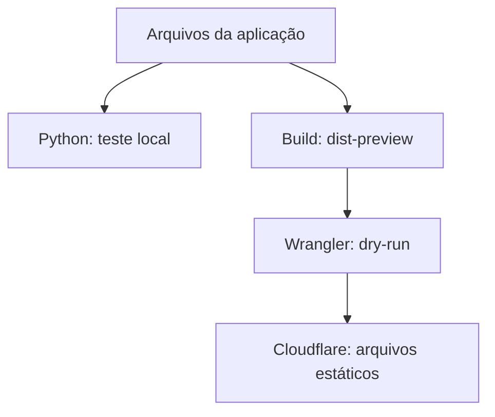

# Publicação EXECUTAR com Wrangler

Revisão: 2026-09-30. Produto atual: arquivos estáticos + estado no navegador.



## O que é publicado

| Origem | Saída | URL |
|---|---|---|
| Página de entrada gerada | `dist-preview/index.html` | `/` |
| `public/executar-editorial/index.html` | `dist-preview/executar-editorial/index.html` | `/executar-editorial/index.html` |
| Manifesto, service worker, ícones e dados | `dist-preview/executar-editorial/` | `/executar-editorial/*` |
| Cabeçalhos gerados | `dist-preview/_headers` | regras de cache aplicadas pela Cloudflare |

Wrangler publica a pasta indicada por `assets.directory`, não o repositório inteiro.
Sem `main`, o Worker serve somente assets. A allowlist do build não inclui arquivos de env, código
backend, dependências, documentos privados ou configurações fullstack. `_headers` é configuração,
não um arquivo público comum. `not_found_handling: "404-page"` mantém URLs desconhecidas como 404.

O build calcula um identificador do conteúdo e o grava no cache do service worker gerado.
Quando o conteúdo muda, mudam os bytes do service worker e a próxima atualização usa um novo cache.
Cabeçalhos `no-cache` permitem revalidar o HTML e o service worker. Isso não limpa o localStorage;
notas e progresso continuam na mesma origem. A instalação e a atualização real em navegador ainda
precisam de smoke test depois da publicação.

## Testar localmente sem serviços nem instalação npm

```bash
python scripts/preview-local.py
```

Abra `http://localhost:8080/`. Esse comando requer apenas Python 3 e não lê env nem usa a Cloudflare.

Para gerar e verificar o pacote com Node 22:

```bash
npm run check
```

Para testar a entrega de assets pelo Wrangler local:

```bash
npm run preview:wrangler
```

Esse último comando baixa/executa apenas o Wrangler fixado em `package.json`, se necessário;
ele não exige D1, KV, OpenAuth ou Workflows. O acesso ao registro npm é necessário para baixar o CLI.

## Validar e publicar pelo terminal

```bash
npm run deploy:check
```

Executa checagens, build e `wrangler deploy --dry-run --config=wrangler.jsonc`.
O dry-run prepara e valida o pacote sem ativar publicação remota. A CI roda esse mesmo CLI real,
sem credenciais da conta Cloudflare.

Para publicar intencionalmente, autentique sua conta Cloudflare (`wrangler login` pelo CLI fixado
ou token de CI autorizado) e execute:

```bash
npm run deploy
```

Esse comando gera o pacote e executa `wrangler deploy --config=wrangler.jsonc` uma única vez.
Ele publica/ativa o Worker indicado por `name`. O preview local não exige autenticação;
a publicação hospedada exige autorização da conta, mesmo sem env da aplicação.

Se o objetivo for apenas criar uma versão com Version URL, sem ativá-la:

```bash
npm run deploy:version
```

`versions upload` cria uma versão; não é o mesmo produto que o novo `wrangler preview`.
Para preview automático de branches, a documentação atual recomenda o comando de Preview do
Workers Builds, configurado no painel e com seus próprios requisitos. O projeto atual não ativa
Previews com recursos externos.

## Configuração do Workers Builds no painel

| Campo | Valor para este repositório |
|---|---|
| Repositório | `executar-23/react-router-hono-fullstack-template` |
| Branch de produção | `main` |
| Root directory | raiz do repositório |
| Build command | `npm run build` |
| Deploy command | `npm exec --yes --package=wrangler@4.136.1 -- wrangler deploy --config=wrangler.jsonc` |
| Name no Wrangler | deve corresponder ao Worker conectado: `react-router-hono-fullstack-template` |
| Env da aplicação / bindings | nenhum requisito no modo estático |

Workers Builds não executa `build.command` do arquivo Wrangler: por isso o build deve ser explícito
no painel. O comando `npm run deploy` também é válido como comando único de deploy, pois faz o build
antes do upload; se escolher essa opção, deixe o campo Build command vazio para não repetir o build.
Não inclua `check:env`, migrações, `deploy:auth` ou `deploy:fullstack` nesse fluxo estático.
As configurações do painel não são alteradas por este commit.

## Conferir após o deploy

1. Verifique o URL apresentado pelo próprio Wrangler, sem inferir que um domínio antigo foi atualizado.
2. Abra `/` e `/executar-editorial/index.html`; teste `/executar-editorial/sw.js` e o manifesto.
3. Instale a PWA em navegador compatível, teste offline após o primeiro carregamento e confirme a
   troca de versão após uma atualização. Exportar backup antes de mudar de origem preserva o trabalho.
4. Confira Scroll Task, mapa, dependências, timer e persistência. Dry-run não comprova esses fluxos em navegador.

## Referências oficiais

- [Workers Static Assets](https://developers.cloudflare.com/workers/static-assets/)
- [Directory e bindings de assets](https://developers.cloudflare.com/workers/static-assets/binding/)
- [Configuração do Workers Builds](https://developers.cloudflare.com/workers/ci-cd/builds/configuration/)
- [Wrangler deploy e dry-run](https://developers.cloudflare.com/workers/wrangler/commands/workers/)
- [Cabeçalhos de assets](https://developers.cloudflare.com/workers/static-assets/headers/)
- [Previews e versões: diferenças](https://developers.cloudflare.com/workers/previews/compare-workflows/)

Fullstack continua separado em `wrangler.fullstack.jsonc`; estes comandos não carregam esse modo.
